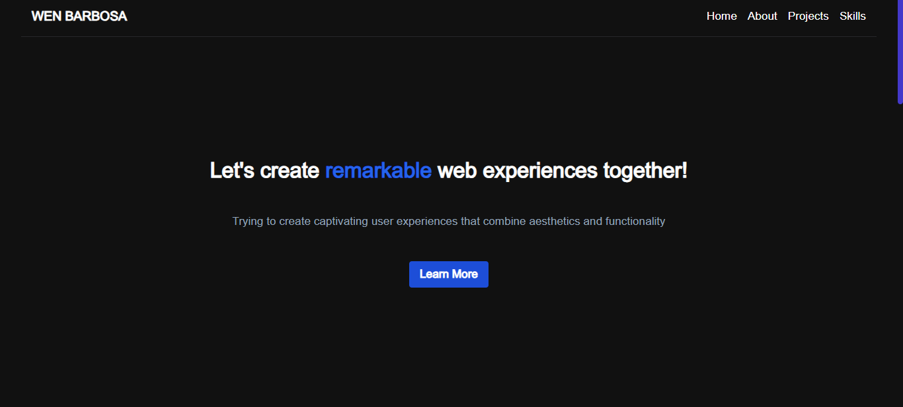

  
<h1 align="center">
  My Portfolio 
</h1>

  
  
  
  
  
  

📝 About the Project:
---
This portfolio demonstrates my expertise in front-end development using Next.js, a powerful React framework. The website features a modern and responsive user interface, thanks to Tailwind CSS, providing seamless navigation on various devices.

💻 Technologies Used:
---
- Next.js: Leveraging the power of server-side rendering and routing for a faster, SEO-friendly experience.
- React: Building interactive and dynamic user interfaces with the most popular JavaScript library.
- TypeScript: Ensuring strict typing and enhanced code quality throughout the project.
- Tailwind CSS: Rapidly styling the components and maintaining consistency with utility-first CSS.

🔃 Future Updates:
---
- 🔲 Light theme ☀️
- 🔲 Automatic detection of the user's system color scheme 🎨
- 🔲 Toggle color scheme button 🌓

I invite you all to take a look at my portfolio website and provide your valuable feedback! Your insights will help me grow and improve as a developer. 😊

